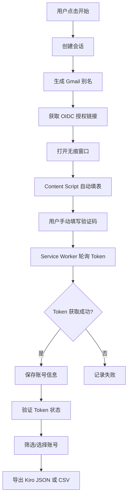

<div align="center">

# 🚀 AWS Auto Registration - Chrome Extension
> fork自：https://github.com/Specia1z/AWS-BuildID-Auto-For-Ext

### ⚡ 一键自动化注册 AWS Builder ID 的浏览器扩展

[](https://chrome.google.com)
[](https://developer.chrome.com/docs/extensions/mv3/intro/)
[](https://www.javascript.com/)
[](LICENSE)

[功能特性](#-功能特性) • [环境准备](#-环境准备) • [安装指南](#-安装指南) • [完整使用流程](#-完整使用流程) • [技术架构](#-技术架构) • [常见问题](#-常见问题)

</div>

---

> ⚠️ **重要提示**：目前插件的**并发多窗口功能不稳定**，建议将并发窗口数设置为 **1**。使用 Gmail 别名模式时需要手动填写验证码。

---

## ✨ 功能特性

### 🎯 核心功能

- **🤖 半自动注册** - 自动填写表单，验证码需手动输入
- **🔄 批量注册** - 支持自定义注册数量（1-100），一键批量创建账号
- **📧 Gmail 无限别名** - 利用 Gmail 特性生成无限邮箱变体（+号/点号/大小写）
- **🕵️ 无痕模式** - 自动创建无痕窗口，隔离会话，防止数据污染
- **🔐 Token 管理** - 自动获取并保存 OIDC Access Token 和 Refresh Token

### 🛡️ 高级功能

- **✅ Token 验证** - 批量验证选中账号的 Token 状态，识别封禁、过期、无效账号
- **🎨 状态筛选** - 下拉筛选不同状态的账号（全部/有效/封禁/过期/无效/未验证/失败）
- **☑️ 批量选择** - 支持全选/反选，勾选指定账号进行批量操作
- **�️ 选中删除** - 仅删除勾选的账号，不再一键清空
- **�📊 Kiro 格式导出** - JSON 导出为 Kiro 账号管理器兼容格式，支持直接导入
- **📋 CSV 导出** - 导出选中账号的完整信息，包含状态列
- **💾 历史记录** - 自动保存注册历史，支持查看、复制、导出
- **🚀 Kiro IDE 同步** - 一键同步 Token 至 Kiro IDE，支持 Windows / macOS / Linux

---

## 📧 Gmail 无限别名

本插件利用 Gmail 的特性，从一个 Gmail 地址生成无限邮箱变体：

| 变体类型 | 示例 | 说明 |
|---------|------|------|
| **+ 号别名** | `user+abc123@gmail.com` | 最可靠，推荐方式 |
| **点号插入** | `u.ser@gmail.com` | Gmail 忽略用户名中的点 |
| **大小写变体** | `UsEr@gmail.com` | Gmail 不区分大小写 |
| **混合变体** | `U.sEr+abc@gmail.com` | 组合以上所有方式 |

> 所有变体都会收到同一个 Gmail 收件箱的邮件

---

## � 环境准备

在安装扩展之前，需要先配置 Google Cloud 项目以启用 Gmail API（用于自动获取验证码）。

### 第一步：创建 Google Cloud 项目

1. 打开 [Google Cloud Console](https://console.cloud.google.com/)
2. 点击顶部导航栏的项目选择器，选择「新建项目」
3. 输入项目名称（例如 `AWS-Auto-Reg`），点击「创建」
4. 等待项目创建完成，确保已切换到该项目

### 第二步：启用 Gmail API

1. 在 Google Cloud Console 中，进入 [API 库](https://console.cloud.google.com/apis/library)
2. 搜索 **Gmail API**
3. 点击 **Gmail API** 卡片，进入详情页
4. 点击「启用」按钮

### 第三步：配置 OAuth 权限请求页面

1. 进入 [OAuth 同意屏幕](https://console.cloud.google.com/apis/credentials/consent)
2. 用户类型选择「外部」(External)，点击「创建」
3. 填写必填信息：
   - **应用名称**：任意名称（例如 `AWS Auto Reg`）
   - **用户支持电子邮件**：选择你的邮箱
   - **开发者联系信息**：填写你的邮箱
4. 点击「保存并继续」
5. 在「范围」页面，点击「添加或移除范围」，搜索并勾选：
   - `https://www.googleapis.com/auth/gmail.readonly`
6. 点击「更新」，然后「保存并继续」
7. 在「测试用户」页面，点击「Add Users」，添加你的 Gmail 地址
8. 点击「保存并继续」，完成配置

### 第四步：创建 OAuth 凭据

1. 进入 [凭据页面](https://console.cloud.google.com/apis/credentials)
2. 点击「创建凭据」→「OAuth 客户端 ID」
3. 应用类型选择 **Web application**（Web 应用）
4. 名称任意填写（例如 `Chrome Extension`）
5. 在「已获授权的重定向 URI」(Authorized redirect URIs) 部分：
   - 先跳到下一节「安装指南」，加载扩展后获取扩展 ID
   - 回到此处，点击「添加 URI」，填写：
     ```
     https://YOUR_EXTENSION_ID.chromiumapp.org/
     ```
     > 将 `YOUR_EXTENSION_ID` 替换为你在 `chrome://extensions/` 中看到的扩展 ID
6. 点击「创建」，**复制生成的 Client ID**

### 第五步：填写 Client ID

1. 打开项目根目录下的 `manifest.json` 文件
2. 找到 `oauth2.client_id` 字段，将复制的 Client ID 填入：
   ```json
   "oauth2": {
     "client_id": "你的Client ID.apps.googleusercontent.com",
     "scopes": ["https://www.googleapis.com/auth/gmail.readonly"]
   }
   ```
3. 保存文件
4. 回到 `chrome://extensions/`，点击扩展的刷新按钮重新加载

### 第六步：添加测试用户

1. 进入 [OAuth 同意屏幕 - 受众群体](https://console.cloud.google.com/auth/audience)
2. 在「Test users」区域，确认你的 Gmail 地址已添加
3. 如未添加，点击「Add Users」添加你的 Gmail 地址

> ✅ 完成以上步骤后，扩展即可通过 Gmail API 自动获取验证码。如果未配置 Gmail API，则需要手动从 Gmail 收件箱获取验证码并填写。

---

## �📦 安装指南

### 方式一：从源码安装（推荐）

1️⃣ **克隆仓库**
```bash
git clone https://github.com/Specia1z/AWS-BuildID-Auto-For-Ext.git
cd AWS-BuildID-Auto-For-Ext
```

2️⃣ **加载扩展**
- 打开 Chrome 浏览器
- 访问 `chrome://extensions/`
- 开启右上角「开发者模式」
- 点击「加载已解压的扩展程序」
- 选择项目根目录
- **记下扩展 ID**（形如 `abcdefghijklmnopqrstuvwxyz`），用于配置 OAuth 重定向 URI

3️⃣ **启用无痕模式**
- 在扩展卡片上，点击「详细信息」
- 找到「在无痕模式下启用」，**必须开启**
- 刷新扩展（点击刷新图标 🔄）

4️⃣ **配置 Gmail API**（可选但推荐）
- 按照上方「环境准备」章节完成 Google Cloud 配置
- 将 Client ID 填入 `manifest.json` 的 `oauth2.client_id`
- 重新加载扩展

### 方式二：安装打包文件

1. 下载 [Releases](https://github.com/Specia1z/AWS-BuildID-Auto-For-Ext/releases) 中的 `extension.crx` 或 `extension.zip`
2. 解压后按照「方式一」的步骤 2-4 加载和配置

---

## 📖 完整使用流程

### 第一步：配置 Gmail 地址

1. 点击浏览器工具栏中的扩展图标，打开弹窗
2. 在「邮箱配置」区域输入你的 Gmail 地址（例如 `example@gmail.com`）
3. 点击「保存」按钮
4. 保存成功后会显示绿色提示

> 扩展会利用 Gmail 的别名特性，自动生成 `example+随机后缀@gmail.com` 等变体，所有变体邮件都会进入同一收件箱。

### 第二步：设置注册参数

1. **注册数量**：设置要注册的账号数量（1-100，建议 ≤ 10）
2. **并发窗口**：建议设为 **1**（多窗口并发不稳定，且需要手动输入验证码）

### 第三步：开始注册

1. 点击「开始注册」按钮
2. 扩展会自动：
   - 生成随机的 Gmail 别名邮箱
   - 获取 AWS OIDC 授权链接
   - 打开无痕窗口，导航至 AWS 注册页面
   - Content Script 自动填写邮箱、姓名、密码等表单字段
3. **当页面要求输入验证码时**：
   - 打开你的 Gmail 收件箱（[mail.google.com](https://mail.google.com)）
   - 找到来自 AWS 的验证码邮件
   - 将 6 位验证码手动输入到注册页面
   - （如果已配置 Gmail API，验证码会自动获取并填写）
4. 验证码提交后，扩展会自动轮询获取 Token
5. Token 获取成功后，无痕窗口会自动关闭，注册结果保存到历史记录

### 第四步：查看注册历史

注册完成后，弹窗底部「注册历史」区域会显示所有账号，包含以下信息：

| 列名 | 说明 |
|------|------|
| **☑️ 勾选框** | 勾选账号以进行批量操作 |
| **邮箱** | 注册使用的 Gmail 别名 |
| **状态** | Token 状态标签（有效/封禁/过期/无效/未验证/失败） |
| **注册时间** | 账号的注册时间 |
| **操作** | 复制 Token、同步至 Kiro 等操作按钮 |

### 第五步：筛选和选择账号

1. **状态筛选**：使用历史区域顶部的下拉框，按状态筛选账号
   - 全部 / 有效 / 封禁 / 过期 / 无效 / 未验证 / 失败
2. **全选/反选**：点击「全选」复选框，一键选中或取消选中当前筛选结果中的所有账号
3. **单独勾选**：点击每行的复选框，选择特定账号

### 第六步：验证 Token 状态

1. 勾选要验证的账号（或全选）
2. 点击「验证」按钮
3. 扩展会对选中的账号发起 Token 有效性检测
4. 验证完成后，每个账号的状态标签会更新：

| 状态 | 含义 | 标签颜色 |
|------|------|----------|
| **有效** | Token 正常可用 | 🟢 绿色 |
| **封禁** | 账号被临时封禁 | 🟡 黄色 |
| **过期** | Token 已过期 | 🟠 橙色 |
| **无效** | 账号无效或被删除 | 🔴 红色 |
| **错误** | 网络或服务器错误 | ⚫ 灰色 |
| **未验证** | 尚未验证 | ⚪ 浅灰 |

### 第七步：导出账号

#### JSON 导出（Kiro 账号管理器格式）

1. 勾选要导出的账号
2. 点击「JSON」按钮
3. 导出文件为 `kiro-accounts-YYYY-MM-DD.json`，格式兼容 Kiro 账号管理器：
   ```json
   {
     "version": "1.3.2",
     "exportedAt": 1234567890,
     "accounts": [
       {
         "email": "user+xxx@gmail.com",
         "nickname": "user+xxx",
         "idp": "BuilderId",
         "credentials": {
           "accessToken": "...",
           "refreshToken": "...",
           "clientId": "...",
           "clientSecret": "...",
           "region": "us-east-1",
           "authMethod": "IdC",
           "provider": "BuilderId"
         },
         "subscription": { "type": "Free" },
         "status": "active"
       }
     ],
     "groups": [],
     "tags": []
   }
   ```
4. 导出时会自动过滤封禁、过期、无效的账号，仅导出有效和未验证的

> 💡 导出的 JSON 可直接导入 Kiro 账号管理器使用。

#### CSV 导出

1. 勾选要导出的账号
2. 点击「CSV」按钮
3. 导出包含所有选中账号的完整信息，包括 Token 状态列

### 第八步：删除账号

1. 勾选要删除的账号
2. 点击「删除」按钮
3. 确认后，仅删除勾选的账号（不会清空全部历史记录）

### 第九步：同步至 Kiro IDE（可选）

1. 在历史记录中找到成功注册且有 Token 的记录
2. 点击该记录旁边的 **「Kiro」** 按钮
3. 插件会自动检测操作系统，生成对应的终端命令并复制到剪贴板
4. 打开对应的终端（Windows 用 PowerShell，macOS/Linux 用 Terminal）
5. 粘贴并执行命令
6. 重启 Kiro IDE 即可使用同步的账号

**支持的系统：**

| 系统 | 终端 | 配置文件路径 |
|------|------|-------------|
| Windows | PowerShell | `%USERPROFILE%\.aws\sso\cache\` |
| macOS | Terminal | `~/.aws/sso/cache/` |
| Linux | Terminal | `~/.aws/sso/cache/` |

---

## 🏗️ 技术架构

### 技术栈

<div align="center">

| 层级 | 技术 | 说明 |
|:----:|:----:|:-----|
| **核心** |  | Chrome Extension API |
| **语言** |  | ES6+ Modules |
| **UI** |   | 原生 HTML/CSS |
| **认证** |  | AWS OIDC Device Flow |

</div>

### 项目结构

```
extension/
├── manifest.json              # 扩展配置（Manifest V3）
├── background/
│   └── service-worker.js     # 后台服务（会话管理、API 调用）
├── content/
│   └── content.js            # 内容脚本（页面自动化）
├── popup/
│   ├── popup.html            # 弹窗界面
│   ├── popup.css             # 弹窗样式
│   └── popup.js              # 弹窗逻辑
├── lib/
│   ├── mail-api.js           # Gmail 无限别名生成器
│   ├── oidc-api.js           # AWS OIDC 认证 API + Token 验证
│   └── utils.js              # 工具函数（密码/姓名生成）
└── icons/
    ├── icon16.png
    ├── icon48.png
    └── icon128.png
```

### 核心流程



---

## ⚠️ 注意事项

- ✅ **必须启用无痕模式权限**，否则无法创建无痕窗口
- ✅ **必须配置 Gmail 地址**，用于生成邮箱别名
- ⚠️ 验证码需要从 Gmail 收件箱手动获取并填写（未配置 Gmail API 时）
- ⚠️ 建议并发窗口设为 1，方便手动输入验证码
- ⚠️ Token 默认状态为「未验证」，需手动点击「验证」按钮
- ⚠️ 验证、导出、删除操作仅针对已勾选的账号
- 📱 仅支持 Chrome 浏览器（基于 Manifest V3）

---

## 🐛 常见问题

<details>
<summary><b>❓ 提示"创建无痕窗口失败"</b></summary>

**原因**：未启用无痕模式权限

**解决方案**：
1. 访问 `chrome://extensions/`
2. 找到本扩展，点击「详细信息」
3. 开启「在无痕模式下启用」
4. 刷新扩展（点击刷新图标 🔄）
</details>

<details>
<summary><b>❓ 提示"未配置 Gmail 地址"</b></summary>

**原因**：未在插件中配置 Gmail 地址

**解决方案**：
1. 点击插件图标打开弹窗
2. 在「邮箱配置」区域输入你的 Gmail 地址
3. 点击「保存」按钮
</details>

<details>
<summary><b>❓ Gmail API 授权失败 / invalid_client 错误</b></summary>

**原因**：OAuth Client ID 未正确配置

**解决方案**：
1. 确认已在 [Google Cloud Console](https://console.cloud.google.com/apis/credentials) 创建 OAuth 凭据
2. 应用类型必须选择 **Web application**
3. 重定向 URI 必须填写 `https://YOUR_EXTENSION_ID.chromiumapp.org/`（注意末尾斜杠）
4. 将 Client ID 正确填入 `manifest.json` 的 `oauth2.client_id`
5. 在 [受众群体](https://console.cloud.google.com/auth/audience) 页面添加测试用户（你的 Gmail 地址）
6. 重新加载扩展
</details>

<details>
<summary><b>❓ 收不到验证码邮件</b></summary>

**原因**：Gmail 别名可能被识别为垃圾邮件

**解决方案**：
1. 检查 Gmail 的「垃圾邮件」文件夹
2. 检查「所有邮件」确保邮件未被过滤
3. 确认 Gmail 地址输入正确
</details>

<details>
<summary><b>❓ 注册页面提示"无效的电子邮件地址"</b></summary>

**原因**：生成的别名邮箱格式不合法（已修复的已知 Bug）

**解决方案**：
1. 确保使用最新版本的扩展
2. 重新加载扩展后重试
</details>

<details>
<summary><b>❓ Kiro 同步后 IDE 仍提示未登录</b></summary>

**原因**：配置文件未正确写入或 Kiro 未重启

**解决方案**：
1. 确认在正确的终端中执行命令（Windows 用 PowerShell，macOS/Linux 用 Terminal）
2. 检查 `~/.aws/sso/cache/` 目录是否存在配置文件
3. 完全退出并重启 Kiro IDE
4. 如果仍有问题，尝试删除旧的配置文件后重新同步
</details>

<details>
<summary><b>❓ Windows 执行命令报错</b></summary>

**原因**：可能使用了 CMD 而非 PowerShell

**解决方案**：
1. 确保使用 **PowerShell** 执行命令（不是 CMD）
2. 右键点击开始菜单，选择「Windows PowerShell」或「终端」
3. 粘贴命令并按回车执行
</details>

---

## 📄 License

本项目基于 [MIT License](LICENSE) 开源。

---

<div align="center">

**⭐ 如果这个项目对你有帮助，请给一个 Star！**

Made with ❤️ by [Specia1z](https://github.com/Specia1z)

</div>
